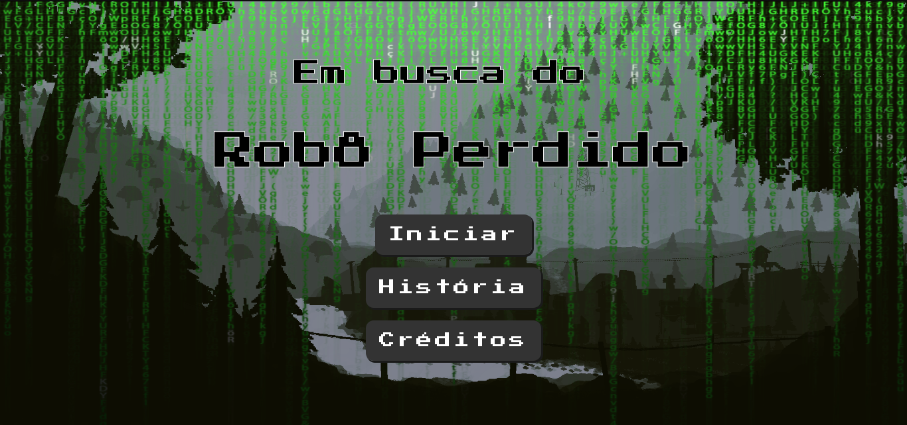
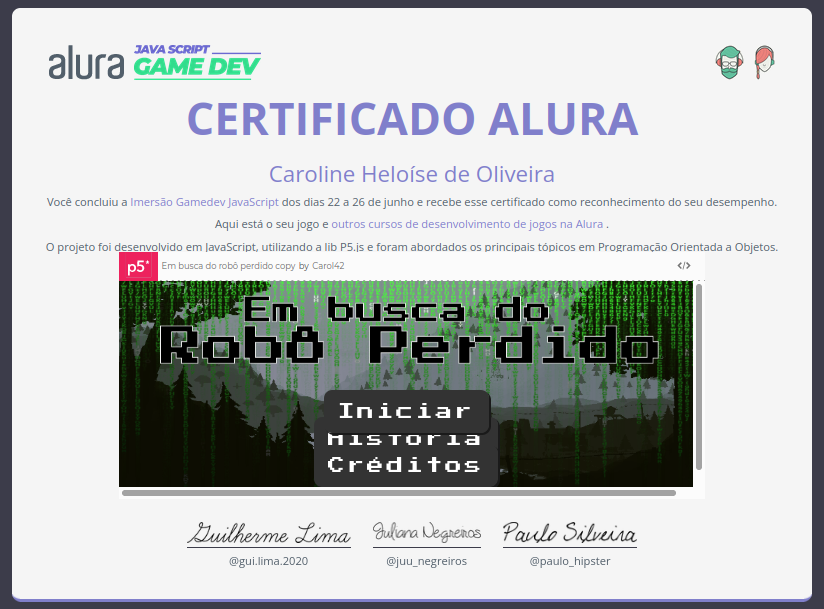
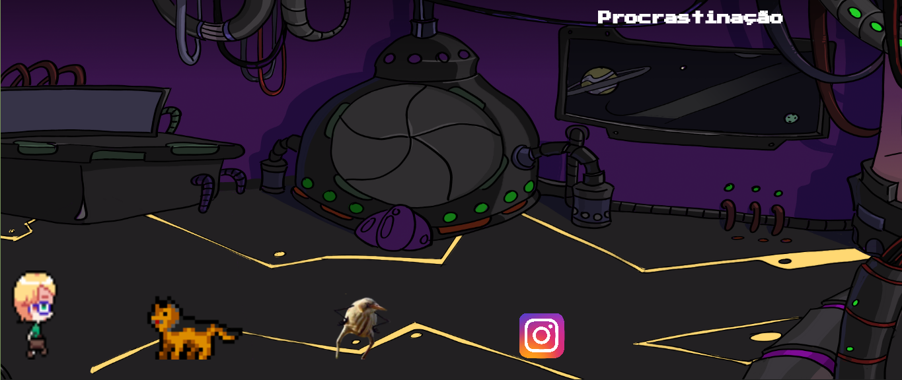
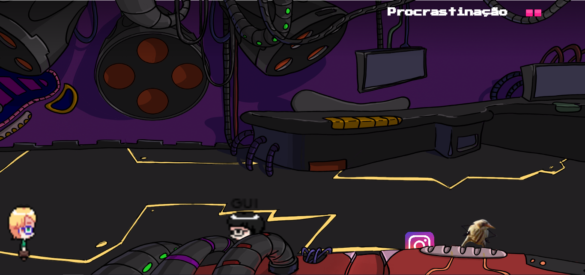

<h1 align='center'>
    
    
</h1>
<h2 align="center" >A short and simple game in tribute to Filipe Deschamps</h2>

<i>“Unfortunately, no one can be told what the Matrix is. You have to see it for yourself." - Morpheus, ‘The Matrix' (1999)</i> 

<h3 align="center">
    :link:
    <a href="https://preview.p5js.org/Carol42/present/qYJRo0QUe">Go to the game demonstration</a>
</h3>
<h4 align="center"> 
    <a href="./README.md"> :brazil: Ir para a versão em Português deste README »</a>
</h4>

    
Table of Contents

    <ol>
        <li><a href="#pushpin-about">About</a></li>
        <li><a href="#scroll-story">Story</a></li>
        <li><a href="#dart-the-goal">The goal</a></li>
        <li><a href="#video_game-how-to-play">How to play</a></li>
        <li><a href="#hammer_and_wrench-technologies">Technologies</a></li>
        <li><a href="#woman_technologist-the-developer">The developer</a></li>
    </ol>

## :pushpin: About

    
This game has been developed during the <a href="https://www.alura.com.br/imersao-gamedev-javascript">Imersão GameDev</a> by <a href="https://www.alura.com.br/">Alura</a>, that was featured between the 22nd and 26th of June 2020 e foi taught by the instructors <a href="https://cursos.alura.com.br/user/guilhermelima">Guilherme Lima</a> and <a href="https://cursos.alura.com.br/user/juunegreiros">Juliana Negreiros</a>.

    
The idea was that, in just a week, we would build a 2D game from scratch, exploring the essential topics about game development and Object Oriented Programming.

    
Among the main topics covered are: animations, collisions, maps, powerups and state management. The <a href="https://imersao-gamedev.github.io/placar/">Placar da Imersão</a> contains the best projects developed during the event.

## :scroll: Story
Tilipe Deschamps (Michel Teló in his free time) is a nice guy whose passion is to make people fall in love with programming. But he wasn't expecting that one of his biggest projects published with this purpose would end up drawing attention from the wrong people, I mean, the wrong machines. The mentioned project featured 4 robots that create and post videos on youtube. In a war between humans and machines, it would become a great source of information about the human mind and a powerful advantage to the machines. 

So that happened. Tilipe's robots were kidnaped. Now he needs to go out on an adventure throughout the dangerous Machine's Kingdom to rescue them. Furthermore, this kingdom is extremely perverse. The machines know how to make humans get distracted easily and forget about their aims. 

## :dart: The Goal

Throughout the course, our hero will be tempted by social media and bird memes. He needs to do his best to avoid these traps and prevent his procrastination bar to reach the highest level, or else the machines will win. However, when seeing Miki, his focus will grow a bit, so look for the dogs! During his adventure, Tilipe will find some friends too. Ally with them or not (and also depending on your procrastination at the moment) can completely change the course of the journey.

Will he succeed and get to the end of the map without procrastinating too much?

## :video_game: How to play

Use the arrow keys to move the character (to the right, to the left and jump). Avoid the bird memes and Instagram. Look for dogs and for the robot at the end of the map!

The game is full of Easter Eggs from the YouTube channel <a href="https://www.youtube.com/c/FilipeDeschamps/videos">Filipe Deschamps</a>. Can you spot all of them?

## :hammer_and_wrench: Technologies

- [p5.js](https://p5js.org/)

## :woman_technologist: The developer

 
<strong>Caroline Heloíse de Oliveira</strong>
 
Computer Engineering Student (UEPG)
 

